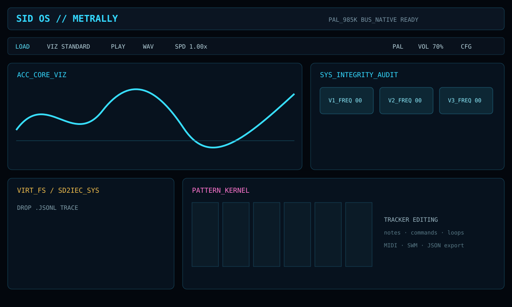
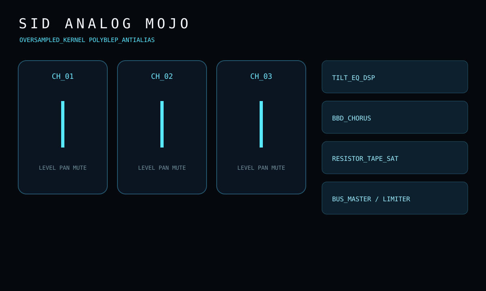
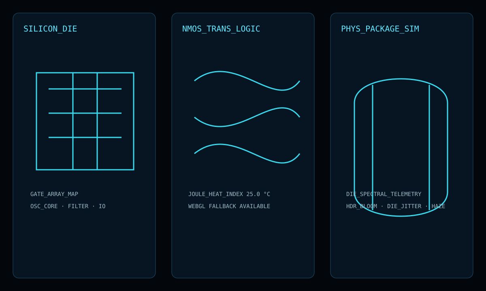
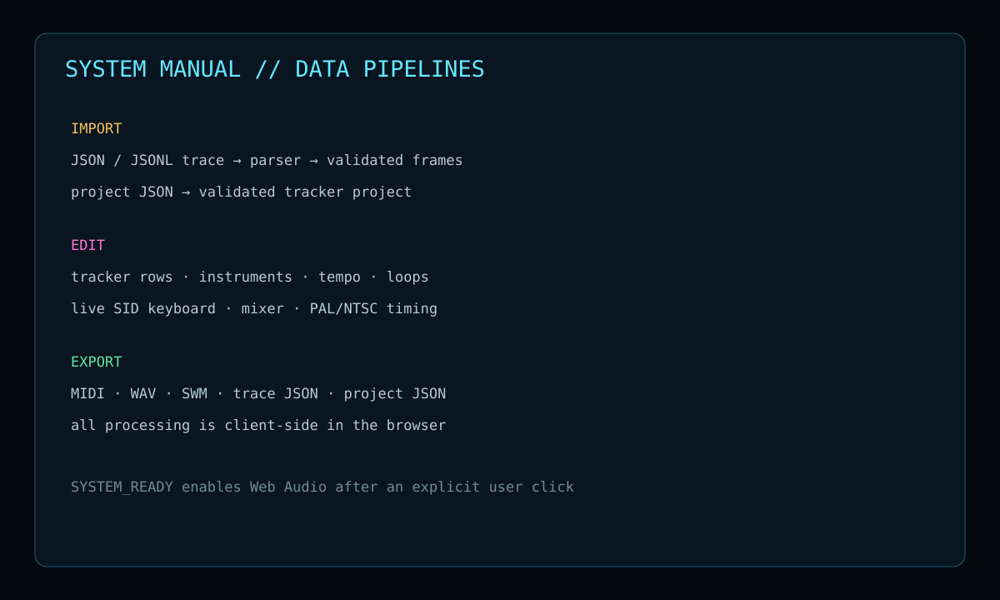

# SID OS — Metrally

SID OS — Metrally is a browser-based Commodore 64 SID workstation for inspecting register traces, replaying them through a cycle-aware Web Audio engine, editing tracker data, shaping the mix, and exporting music data. It is a self-contained, CRT-inspired laboratory: all processing happens locally in the browser and no API key or backend service is required.



## What it does

| Area | Capabilities |
| --- | --- |
| Playback | PAL/NTSC clocks, cycle-sorted SID writes, speed control, voice masks, seek and stop |
| Audio | AudioWorklet SID synthesis, ADSR, oscillator sync/ring modulation, noise LFSR, filter models, stereo mixer |
| Editing | Trace-to-tracker conversion, pattern cells, instruments, arpeggios, portamento, loops and tempo tables |
| Visuals | Oscilloscope/vector views, SID die map, NMOS logic, physical-package simulation and audit telemetry |
| Mixing | Per-voice level/pan/mute/solo, EQ, tape, compressor, exciter, reverb, chorus, imager and limiter |
| Export | WAV, MIDI, SWM, trace JSON and tracker-project JSON |
| Storage | Local virtual SD workspace with drag-and-drop trace mounting |

See the visual feature gallery in [docs/SCREENSHOTS.md](docs/SCREENSHOTS.md).

## Quick start

Requirements: Node.js 20+ and pnpm 11+.

```sh
pnpm install
pnpm run dev
```

Open the Vite URL (normally `http://localhost:5173/`; use the port printed by Vite). Click `SYSTEM_READY` once to enable the browser audio bus. For a production bundle:

```sh
pnpm run build
pnpm run preview
```

Do not open `index.html` directly with `file://`. Browsers intentionally block the TypeScript module graph from a local file origin. If `@vite/client` or a dynamic-import request returns 404, stop the old server, run `pnpm run dev` from the repository root, and reload the Vite URL.

## Typical workflow

1. Start the dev server and click `SYSTEM_READY`.
2. Use `LOAD` or `SD_DISK` → `INSERT` to mount a trace.
3. Open `ACC_CORE_VIZ`, `SYS_AUDIT`, `SIL_DIE`, `NMOS_LOGIC`, or `PHYS_SID` to inspect playback telemetry.
4. Open `KERN_SEQ` to edit tracker rows and sequence order. Use `SYNTH_MAP` for instruments and the virtual keyboard.
5. Open `DSP_MIXER` for channel balance and mastering parameters.
6. Export MIDI, WAV, SWM, JSON trace, or project JSON from the transport bar.

## Supported input formats

### Pipe-delimited trace

One write per line:

```text
<cycle>|<SID register hex>|<value hex>
```

Example:

```text
0|04|11
9852|00|34
19704|01|08
```

### JSON / JSONL

The loader accepts an event array or an object containing `events` or `writeLog`. Each event may use `cycles`/`cycle`, `reg`/`addr`, and `val`/`value`. Invalid cycles, registers, and values are ignored. An optional `header.clock` or top-level `clock` is preserved for timing.

## Controls and timing

- `PLAY` / `PAUSE` starts and suspends AudioWorklet processing.
- `STOP` pauses and seeks to cycle zero.
- `SPD` cycles playback speed from 0.5× through 2×.
- `PAL` / `NTSC` changes the selected SID clock and reloads the active trace timing.
- `VOL` controls the master Web Audio gain.
- `CFG` exposes chip model, CRT, luminosity, hexadecimal cells, and manual frame-rate override.
- `MIX` exposes per-voice pan, mute, solo, level, mastering and bus controls.

The player uses the selected SID clock for cycle advancement; trace writes are sorted stably by cycle. The visualizer and tracker conversion use the trace frame rate or the configured override.

## Screenshots

The repository includes release documentation images for the main feature groups:







These images are maintained as lightweight, repository-native feature captures so the README renders without an external image host. The live UI was also checked in the Vite browser during the release audit.

## Project map

- `App.tsx` — workstation shell, window orchestration, transport, import/export and lifecycle.
- `services/sidService.ts` — trace parsing, frame reconstruction, AudioWorklet SID engine and telemetry.
- `services/projectLoaderService.ts` — project validation and tracker-to-trace rendering.
- `services/editorService.ts` — immutable pattern, sequence and instrument editing operations.
- `services/midiExportService.ts` — validated MIDI generation for raw traces and edited projects.
- `services/audioExportService.ts` — WAV container encoding for rendered `AudioBuffer` data.
- `services/swmExportService.ts` and `services/swmTableService.ts` — SID-Wizard/SWM serialization.
- `components/` — visualizers, tracker/editor windows, dialogs, mixer and virtual filesystem.
- `docs/ARCHITECTURE.md` — runtime flow, audio lifecycle and safety boundaries.
- `docs/SCREENSHOTS.md` — screenshot gallery and feature index.

## Development and verification

```sh
pnpm install
pnpm exec tsc --noEmit
pnpm run build
pnpm run dev
```

The project is client-only. No trace, project, audio or MIDI data is uploaded by the application. WebGL visualizers degrade to an explicit fallback message when the browser cannot create a WebGL context.

## Troubleshooting

- **Blank page or `file://` CORS error:** run Vite and open its HTTP URL.
- **`@vite/client` or dynamic-import 404:** restart Vite from the repository root.
- **No sound:** click `SYSTEM_READY`, check browser audio permissions, and verify the master volume.
- **Silent trace:** confirm that cycle values are finite/non-negative and register values are valid hexadecimal bytes.
- **WebGL message:** the audio, tracker, mixer, audit and export features remain available; only the affected 3D panel is unavailable.
- **Large bundle warning:** the current build is valid; future releases can split the Three.js/visualizer code with dynamic imports.

## Metadata and license

- Package: `sid-os-metrally`
- Current release line: `0.95.x`
- License: [GPL-3.0-or-later](LICENSE)
- Repository: [github.com/djayuffe/sid-os-metrally](https://github.com/djayuffe/sid-os-metrally)
- Metadata: [metadata.json](metadata.json)

Contributions should preserve client-only operation, validate imported data, and keep audio-context creation behind explicit user interaction.
